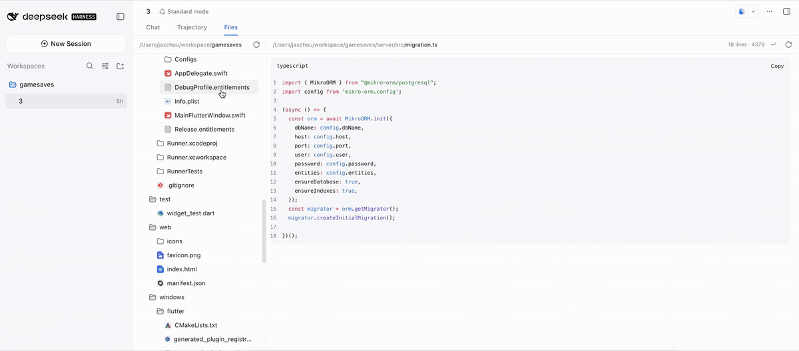

# dsh-file-explorer

[](https://www.npmjs.com/package/@jaxzhou/dsh-file-explorer)
[](../LICENSE)

[English](../README.md) | 中文

> npm 包名是 **`@jaxzhou/dsh-file-explorer`** —— 无作用域的 `dsh-file-explorer`
> 属于另一位作者的插件。

为 [DeepSeek Harness](https://github.com/deepseek-ai/deepseek-harness) 增加一个
**文件** 标签，与 **对话**、**轨迹** 并列：左侧是会话工作区的目录树，右侧的预览
会按文件本身决定形态 —— 渲染后的 Markdown（含图表）、HTML 页面、JSON 树、语法
高亮源码、图片、PDF，以及解包后的 Word / Excel / PowerPoint 文档。只读、无需配置、
不落任何数据。

```sh
dsh plugin --profile web add @jaxzhou/dsh-file-explorer
dsh --profile web
```

## 演示

[](../media/demo.mp4)

*15 秒录屏 —— 点击可打开完整画质的 MP4。* 一个小数学工作区：渲染后的讲义文档
（含表格）、切到 **源码** 看它背后的 Markdown、在旁边用另一个标签打开第二份文档，
最后把它导出为 PDF。

**录屏来自比下面更早的版本。** 它早于 Mermaid 图表、PDF 与 Office 预览，也早于
「在窗格里直接下载文件」，其中那次导出仍然把页面交给浏览器的打印对话框 —— 现在的
导出都不会。

## 能做什么

左栏是会话的工作目录，逐层展开，目录在前；展开过的层级在切换预览标签后仍然保持。

点击文件会在标签中打开它，因此可以同时打开多个文件——每个标签有自己的预览体、
自己的换行设置。已打开的文件会被聚焦而不是重复打开；同名的标签会带上所在目录；
点标签上的 × 或中键点击即可关闭。

右栏按文件类别选择每个标签的预览体：

| 类别 | 预览 |
|---|---|
| **Markdown** | 直接渲染为 GFM —— 标题、表格、任务列表、引用、公式、脚注、引用文件旁的图片、高亮的代码围栏、**Mermaid 图表** —— 并带 **源码** 切换与 **导出** 菜单 |
| **HTML** | 在沙箱 iframe 中当作页面绘制：文件自己的 CSS 生效，其脚本运行在不透明源（opaque origin）里，无法触达本应用。带 **源码** 切换与 **导出** 菜单 |
| **JSON** | 可折叠树，每个值可单独复制，同样带 **源码** 切换 |
| **源码** | 24 种语法的语法高亮、行号与复制按钮：TypeScript/JavaScript、shell、Python、Ruby、Go、Rust、Java、C、C++、C#、Kotlin、Swift、PHP、YAML、TOML、INI、HTML、CSS、SCSS、Less、SQL、XML、Lua、MDX |
| **图片** | PNG、JPEG、GIF、WebP、AVIF、BMP、ICO、SVG，自动适配窗格。SVG 经 `` 绘制，其中的脚本不会执行 |
| **PDF** | 交由浏览器自带的 PDF 阅读器绘制，用的是文件自身的字节 —— 因此其中的文字是真文字 |
| **Word / Excel / PowerPoint** | `.docx`、`.xlsx`、`.pptx` 在页面内解包：文档的标题、列表、引用、表格、图片与代码，并按**文档自身的格式**绘制——每段文字的**字体、字号**、粗体、斜体、下划线、删除线、上/下标、颜色与高亮，以及每个段落的对齐、缩进与间距，全部经**样式级联**解析而不是只看 run 上写了什么；工作簿按工作表显示为网格，并以日期显示它按数字存储的日期；演示文稿按幻灯片显示其文字与图片的提纲 |
| **其它** | 带行号的纯文本 —— 未映射的后缀（`.vue`、`.proto`、`.txt`）保持纯文本，而不是猜测一个错误的高亮。旧版二进制 Office 格式（`.doc`、`.xls`、`.ppt`）不做预览：窗格会说明原因并提供下载 |

**Mermaid** 代码围栏（` ```mermaid `）是图表而不是源码，窗格会把它画出来：
流程图、时序图、状态图、类图、ER 图、甘特图、饼图，以及 Mermaid 11 支持的其它
类型。它在出现的每一处都是图像 —— 预览、PDF 页面、Word 文档携带的是同一张图 ——
所见即所得。Mermaid 无法解析的图表会保留源码，并在其上方说明失败原因。

文本预览在空格处折行、保持单词完整；图片读取完整字节。

每种预览的窗格工具栏里只有**一个导出按钮**，菜单第一行是 **下载**，保存的是文件本身
而不是它的某种转换 —— 因此这一行对**所有**文件类型都在，包括本窗格不绘制的那些。
**它不受文件大小限制**：下载按窗口逐段读取而不是一次性读完，所以比预览上限更大的
文件也能正常保存——260 MB 的发布包也不例外。32 MiB 以内静默存到浏览器的下载目录；
超过则询问保存位置并直接流式写入，因此内存占用与文件大小无关。可以同时进行多个下载，
每个都有自己的进度行和 **取消**，其中一个失败不影响其余。

每一种文本预览还有 **复制**，复制的是文件自身的文本——渲染态的 Markdown 复制的是它的
Markdown 源码。

窗格里的每个控件都是图标而不是文字：名称由悬浮提示与无障碍标签给出，开关状态由填充
色表示。

渲染态的 Markdown 与 HTML 会在该菜单里再加两行 —— **PDF** 与 **Word** ——
各自 **直接下载文件**（不走打印对话框）：

| 格式 | 说明 |
|---|---|
| **PDF** | 页面的图像：按 A4 排版并分页切分。其中的文字**不可选中**。这是刻意的：中文文档若用文本模式生成 PDF，就必须在插件里内嵌 CJK 字体——对一个预览工具来说是好几 MB |
| **Word**（`.docx`） | 真正的 Word 文档：标题、列表、表格、代码与图片都在，文字仍是文字——可编辑、可搜索，中文交给 Word 自己的字体渲染 |

文档自带的本地资源会一起带上：Markdown 文件旁边引用的图片，以及 HTML 文件链接的
图片与样式表。

## 环境要求

DeepSeek Harness **0.1.5-rc.2** 的 **Web** 界面 —— `dsh web`，或由
`@deepseek-ai/dsh-base` + `@deepseek-ai/dsh-web-app` 组合出的 profile。headless
或 SDK profile 没有浏览器，不会出现该标签。插件没有配置项，`cordis.yml` 无需
任何设置。

## 安装

```sh
dsh plugin --profile web add @jaxzhou/dsh-file-explorer
dsh --profile web                 # bundle 成员在启动时读取
```

自定义 profile 需要先具备 Web 组合：

```sh
dsh --profile myprofile --from-default-profile web
dsh plugin --profile myprofile add @jaxzhou/dsh-file-explorer
dsh --profile myprofile
```

偏好本地检出或 git ref？无需构建 —— 运行产物已提交：

```sh
dsh plugin --profile web add /path/to/dsh-file-explorer
dsh plugin --profile web add github:jaxzhou/dsh-file-explorer
```

然后打开一个已有工作区的会话，点击 **文件** 标签。确认层已生效：

```sh
dsh --profile web --dump-config | grep -A 2 jaxzhou-file-explorer
```

## 停用与卸载

不用卸载也能关掉这个标签：在 profile 的 `cordis.patch.yml` 里加一条行覆盖
（它在所有 bundle 层之后应用；`patchReload: live` 的 profile 无需重启即可生效）：

```yaml
- id: jaxzhou-file-explorer
  disabled: true
```

卸载：`dsh plugin --profile web remove @jaxzhou/dsh-file-explorer`，然后重启
profile。

## 隐私

- **只读**：读取走 Harness 自带的 `workspaceFiles` Remote 命名空间，可读性由
  Host 的文件系统决定。插件自身不持有文件权限、不做路径解析、不接触凭据。
- **不落数据**：不写磁盘、不写会话日志；视图状态保存在内存中，随会话一起释放。
- **Host 半边是空实现**：包的 Node 侧不注册任何服务、工具、提示词片段或事件。
- **图表在页面内绘制**：Mermaid 打包在插件里、在本地运行；绘制图表不会向任何地方
  发起请求。
- **Office 文档在页面内解包**：`.docx`、`.xlsx`、`.pptx` 由本插件自己的读取器在本地
  解析，内容不会离开浏览器。PDF 则以本地 blob URL 交给浏览器自带的阅读器。
- **HTML 在沙箱中运行**：预览页面的脚本执行于不透明源，无法读取本应用的 DOM、
  存储或会话；导出时会先剥除脚本再打印。SVG 经 `` 绘制，脚本完全不执行。

## 已知限制

- **只预览** —— 不编辑、不保存、不做 diff。
- **JSON 按严格语法解析**：注释或尾逗号会让文件成为 JSONC，`JSON.parse` 会拒绝
  —— `tsconfig.json` 是最常见的情况。此时窗格会说明原因并显示高亮源码，而不是
  勉强猜出一棵树。
- **文本预览上限 2 000 行**，并提示已截断、没有「加载更多」；二进制文件会说明
  为何无法显示。
- **固定的语法集**：共享高亮器未包含的后缀按纯文本显示，绝不做近似高亮。
- **仅目录列表** —— 没有搜索、重命名、右键菜单，也不监听文件变化；某一层通过
  **重新读取** 更新。
- **已加载的预览有上限**：最近使用的 5 个标签保留内容；更早的标签仍然开着，只是
  回到它时会重新读取。
- **单一根目录**：目录树以会话工作目录为根，Host 本身也拒绝读取工作区根之外的
  目录列表。
- **Markdown 会读入它旁边的图片**：相对文档的图片路径会通过与文件本身相同的
  工作区读取通道加载——上限为每篇 24 张、单张 8 MiB。行内代码里的文件提及、远程
  URL、绝对路径则交给渲染器自己的规则：第一个保持原样，第二个直接加载，第三个
  不会去读。
- **HTML 预览不解析相对资源**：由 Blob 文档绘制出的页面没有可用来解析自身
  `style.css` 或图片的 base，所以预览里只有绝对 URL 能加载。**导出时会解析**——
  写出的文件来自一份被补齐成自包含的副本——所以可能有「预览里看不到图，导出里
  有图」的情况。
- **导出的 PDF 里文字是图像**，无法选中或搜索（**预览** PDF 用的是浏览器自带的
  阅读器，文字可选）。需要文字可编辑时请导出 Word。
- **Mermaid 图表同样是图像**：它只绘制一次（PNG），供预览与两种导出共用 —— 因此
  其中的标签不可选中，且始终以白底绘制：PDF 页面与 Word 文档都是白底，为深色窗格
  绘制的图在它们上面会看不见。绘制范围是 Mermaid 11 支持的图表类型；语法错误的
  图表会保留源码，并在上方说明失败原因。
- **Office 预览是内容，不是排版**：`.docx` 显示标题、列表、引用、表格、图片，以及文档
  自身携带的格式 —— 每段文字的字体、字号、字重、下划线、删除线、上/下标、颜色与高亮，
  每个段落的对齐、缩进与间距 —— 这些都经**样式级联**解析，所以「格式定义在样式里而不是
  写在 run 上」的文字也会按文档的本意绘制。**没有**的是所有需要排版引擎的东西：分栏与
  分页、页眉页脚、表格边框与底纹、文本框、图表、SmartArt、动画。**主题字体**同样不解析
  —— 引用主题的 run 使用页面自身的默认字体，而不是去猜主题是什么。`.xlsx` 显示单元格的
  值；`.pptx` 显示每页的文字与图片。公式显示文件缓存的值，不做重算。
- **只读取 OOXML 格式**：`.doc`、`.xls`、`.ppt` 是更早的二进制容器，本窗格不解析
  —— 会说明这一点并提供下载。
- **预览受「完整读取」上限约束**：官方 Web 组合默认 32 MiB，超过的 PDF 或 Office
  包会报告被拒绝，而不是截断后显示。**下载不受此限制** —— 它按窗口分页读取 —— 所以
  预览不了的文件仍然可以保存。
- **大文件下载会走浏览器的保存对话框**：超过 32 MiB 时字节流式写入你选择的文件，
  内存占用因此恒定；不支持该 API 的浏览器会先收集文件，此时超大下载会占用等量内存。
- **超长文档会在 60 页 PDF 处截断**，单张超过 8 MiB 的图片会被跳过；写在这里是因为
  静默截断会被误认为完整导出。

## 参与开发

构建、检查、产物模型，以及客户端 bundle 如何抵达浏览器：
[CONTRIBUTING.md](../CONTRIBUTING.md)。

## 许可证

MIT —— 见 [LICENSE](../LICENSE)。
